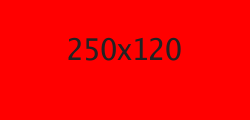

go-imgplaceholder
=================

## Install

~~~text
$ go get github.com/gedex/go-imgplaceholder
~~~

## Usage

1 Start the server:

  ~~~text
  $ go-imgplaceholder
  ~~~

2 Request imgplaceholder in form of `/{width}x{height}/{bg}/{fg}`, for instance:

  * http://localhost:8080/250

    

  * http://localhost:8080/250x120/ff0000/222

    

## License

This library is distributed under the BSD-style license found in the LICENSE.md file.
